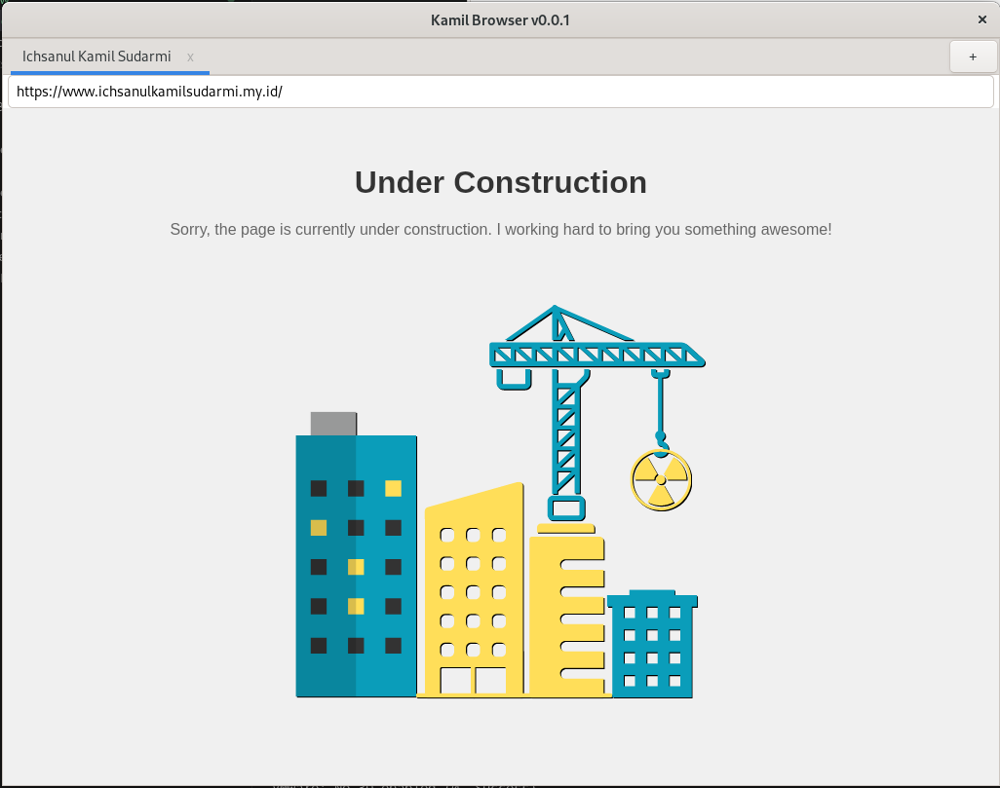

# kamilBrowser

kamilBrowser adalah browser sederhana berbasis **GTK+3** dan **WebKitGTK**, ditulis dalam bahasa C. Dibuat dan diuji di Debian Linux, kamilBrowser menyediakan fungsi dasar browsing seperti address bar, membuka halaman web, tab baru, dan menutup tab.



## ✨ Fitur (v0.0.1)

- ✅ Address bar untuk memasukkan URL
- ✅ Dukungan membuka halaman web dari internet
- ✅ Membuka tab baru
- ✅ Menutup tab

## ✅ Kompatibilitas

| Sistem Operasi | Kompatibel |
|----------------|------------|
| Linux (Debian) | ✅ Ya       |
| Windows        | ❌ Tidak    |
| macOS          | ❌ Belum    |

> ❗ WebKitGTK tidak didukung secara resmi di Windows. Build hanya tersedia untuk Linux.

## 🧰 Dependensi

Pastikan sistem Anda memiliki:

- `gtk+-3.0`
- `webkit2gtk-4.0`
- `gcc`
- `make`
- `pkg-config`

## 🛠 Build (Linux / Debian)

Untuk membangun proyek:

```bash
make