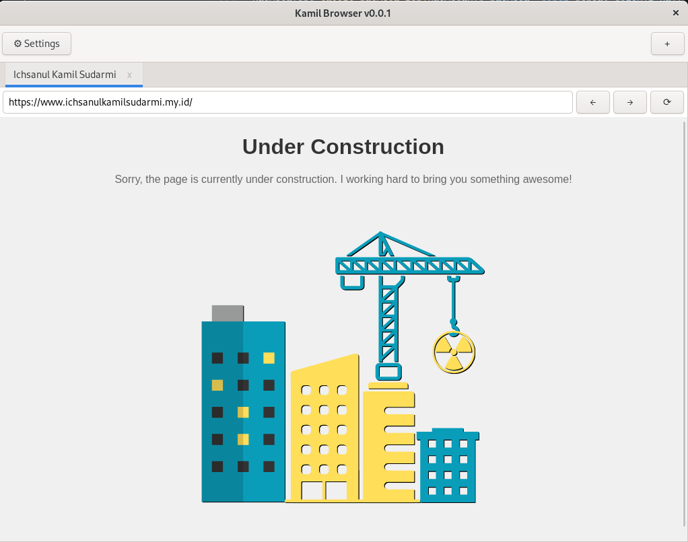

# kamilBrowser

kamilBrowser adalah browser sederhana berbasis **GTK+3** dan **WebKitGTK**, ditulis dalam bahasa C. Dibuat dan diuji di Debian Linux, kamilBrowser menyediakan fungsi dasar browsing seperti address bar, membuka halaman web, tab baru, dan menutup tab.



## ✨ Fitur (v0.0.2)

- ✅ Address bar untuk memasukkan URL
- ✅ Dukungan membuka halaman web dari internet
- ✅ Membuka tab baru
- ✅ Menutup tab
- ✅ Tombol navigasi **Back** dan **Forward**
- ✅ Tombol **Refresh/Reload**
- ✅ Halaman utama default (homepage)

## 🔄 Changelog

### v0.0.2
- ➕ Menambahkan tombol navigasi: **Back**, **Forward**, dan **Refresh**
- 🏠 Menambahkan default homepage saat browser pertama kali dibuka
- 🧹 Refaktor kode dan struktur file
- 🐛 Memperbaiki bug pemanggilan sinyal `g_signal_connect` pada UI

### v0.0.1
- 🎉 Rilis awal
- Address bar dan web view dasar
- Tab baru dan penutupan tab

## ✅ Kompatibilitas

| Sistem Operasi | Kompatibel |
|----------------|------------|
| Linux (Debian) | ✅ Ya       |
| Windows        | ❌ Tidak    |
| macOS          | ❌ Belum    |

> ❗ WebKitGTK tidak didukung secara resmi di Windows. Build hanya tersedia untuk Linux.

## 🧰 Dependensi

Pastikan sistem Anda memiliki:

- `gtk+-3.0`
- `webkit2gtk-4.0`
- `gcc`
- `make`
- `pkg-config`

## 🛠 Build (Linux / Debian)

Untuk membangun proyek:

```bash
make
```

## Rencana Fitur Berikutnya
- 🎨 Dark Mode
- 📁 Bookmark
- 🔒 Private Mode
- 🧩 Extension Support
- ⚡ Optimasi RAM untuk tab beku otomatis, preview ringan
- 🛡️ Privasi tinggi: open-source, no tracking, no fingerprinting
- 🧩 Modular: fitur plugin-style bisa diaktif/nonaktif
- 🧼 UI clean: fokus konten, dark/light auto toggle
- 🧭 Tab management: split view, tab grid, workspace session
- 🔄 Device sync tanpa akun (pairing-based)
- 👨‍💻 Dev-friendly: inspect tools ringan, native debug mode
- 🤖 AI opsional: highlight, summarizer (lokal, non-cloud)